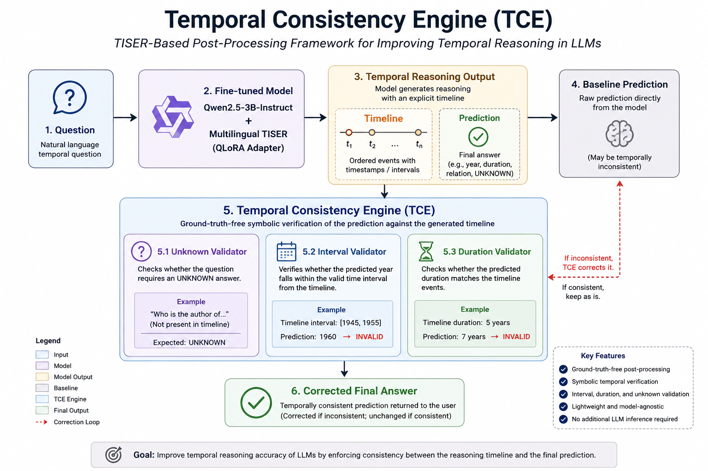

# TISER-Based Temporal Consistency Engine (TCE)

A lightweight symbolic post-processing framework that improves temporal reasoning in Large Language Models by verifying the consistency between the model's generated timeline and its final answer.

---

## Architecture

<p align="center">
  
</p>

---

## Overview

Large Language Models can often generate a correct temporal reasoning process while still producing an inconsistent final answer.

This project introduces the **Temporal Consistency Engine (TCE)**, a lightweight symbolic verification framework built on top of the multilingual **TISER** temporal reasoning framework.

Instead of retraining the model or performing another LLM inference, TCE analyzes the generated timeline and applies symbolic temporal validation before returning the final answer.

---

## Key Features

- Ground-truth-free post-processing
- Symbolic temporal verification
- Interval reasoning
- Duration reasoning
- Unknown answer validation
- Lightweight and model-agnostic
- No additional LLM inference required

---

## Architecture

Question
↓
Fine-tuned Qwen + TISER
↓
Reasoning
↓
Timeline
↓
Prediction
↓
Temporal Consistency Engine
├── Unknown Validator
├── Interval Validator
└── Duration Validator
↓
Corrected Prediction

---

## Experimental Results

### 100 Samples (Official Repository Prompt)

| Method | NormEM | F1 |
|---------|--------|------|
| Baseline | 0.690 | 0.808 |
| TCE | **0.720** | **0.840** |

---

### 500 Balanced Samples

| Method | NormEM | F1 |
|---------|--------|------|
| Baseline | 0.610 | 0.703 |
| TCE | **0.662** | **0.757** |

Note: The 500-sample experiment was performed using the stored dataset prompt, while the 100-sample experiment uses the official reconstructed repository prompt. In both cases, TCE is evaluated against the corresponding baseline generated with the same prompt configuration.
---

## Repository Contents

- Temporal_Consistency_Engine.ipynb
- Complete experimental pipeline
- Baseline evaluation
- Prompt reconstruction
- Temporal Consistency Engine implementation
- Evaluation and error analysis

---

## Dataset

The dataset is **not included** in this repository.

Please obtain the original TISER benchmark from the official repository and update the notebook paths accordingly.

---

## Dependencies

- Python
- PyTorch
- Transformers
- PEFT
- Accelerate
- BitsAndBytes

---

## Acknowledgements

This work builds upon the **Multilingual TISER** framework for temporal reasoning.

The Temporal Consistency Engine (TCE) is an independent symbolic post-processing extension developed as part of a Deep NLP project.

## How to Run

This project was developed and evaluated in Google Colab.

1. Clone the original Multilingual TISER repository:

```bash
git clone https://github.com/arianmo477/MultilingualTemporalReasoningTISER.git

---

## Future Work

- Successor validator
- Predecessor validator
- Ordering validator
- Graph-based temporal reasoning
- Adaptive reflection triggered by temporal inconsistencies
